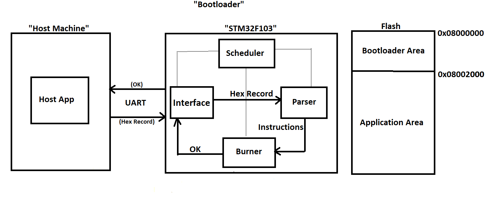

# UART_Bootloader
```
>> This is a UART Bootloader to update the Software of STM32F103 through UART
>> We used the host application to send the hex file through the UART
>> The project consist of the Host App, Bootloadear, and a Blinking Example App
```

## Table of Contents
- [Hardware](#hardware)
- [Block Definition Diagram for the System](#block_definition_diagram_for_the_system)
- [Host App](#host_app)
  - [Getting Started](#getting_started)
    - [Prerequisites](#Prerequisites)
    - [Installation](#installation)
  - [Usage](#usage)
- [Bootloader](#bootloader)
  - [Getting Started](#getting_started)
    - [Prerequisites](#Prerequisites)
    - [Installation](#installation)
  - [Usage](#usage)
  - [Examples](#examples)
- [Blinking Application](#blinking_application)
- [License](#license)


## Hardware
```
Stm32f103
USB To TTL Module
Host Machine
```

  
## Block Definition Diagram for the System


## Host App
### Getting Started
```
- This is a C code used to send the Hex File Record by Record through the serial Port
- It's not allowed to send the next Record before recieving an OK message from the target 
```
#### Prerequisites:
```
- gcc
- make
```
#### Installation:
1. Clone the repo
```
$ git clone https://github.com/GomaaMohamed/UART_Bootloader.git
```
2. change the path of the project home in makefile of the host app
3. Open the terminal inside the host_app folder and build the application to get the executable
```
$ make all
"this will generate a binary executable named burner"
```
### Usage
1. Change the permissions of the serial port that will be used
```
$ sudo chmod 777 /dev/ttyUSB0
```
2. Send the Hex File
```
$ ./burner ./app.hex /dev/ttyUSB0
```

## Bootloader
### Getting Started
```
- This is the bootloader that will be used to recieve the hex file from host app and burns it
- It's not allowed to recieve a hex record before analysing and burning the previous one
- The bootloader consists of the mcal layer that contains the drivers of mcu
- Additionally it consisst of the app layer that contains the software components of the application
  Interface Module: recieves the hex file record by record and send it to Parser Module
  Parser Module: analyses the hex record, perform check sum convert hex record from ascci to hex,
                 sets endianess, and sends the binary istructions to Burner Module
  Burner Module: burns, and verifies the binary instructions in the internal flash
```
#### Prerequisites:
```
- arm-none-eabi-gcc
- make
- st-flash
- gdb-multiarch
- openocd
```
#### Installation:


